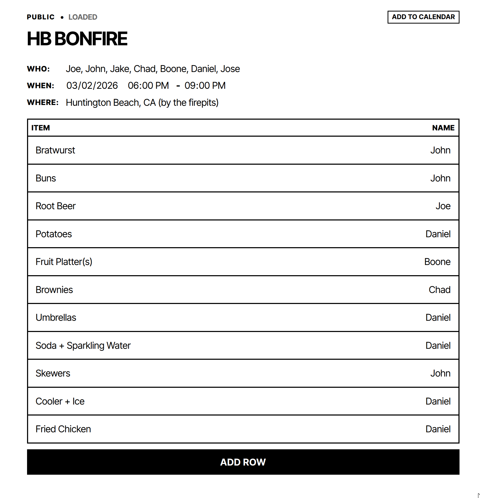
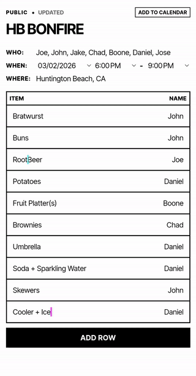

# BringIt

BringIt is a lightweight shared planning board for group events. Create a list, share the link, and let everyone fill in who is coming, when the event starts, where it is happening, and who is bringing what.

## Demo





## What It Does

- Creates a shareable list URL as soon as you start a new list
- Syncs edits live across connected browsers with Socket.IO
- Keeps the interface simple and mobile friendly
- Exports the event to a calendar file
- Stores data locally in SQLite for easy self-hosting

## Stack

- Node.js
- Express
- Socket.IO
- SQLite via `better-sqlite3`
- Plain HTML, CSS, and JavaScript

## Local Setup

1. Install dependencies:

```bash
npm install
```

2. Start the app:

```bash
node server.js
```

3. Open `http://localhost:3000`

## Notes

- The local database file is created automatically when the server starts.
- This repo is set up for local or simple VPS hosting.
- GitHub Pages alone is not enough because the app needs a Node server and WebSockets.
